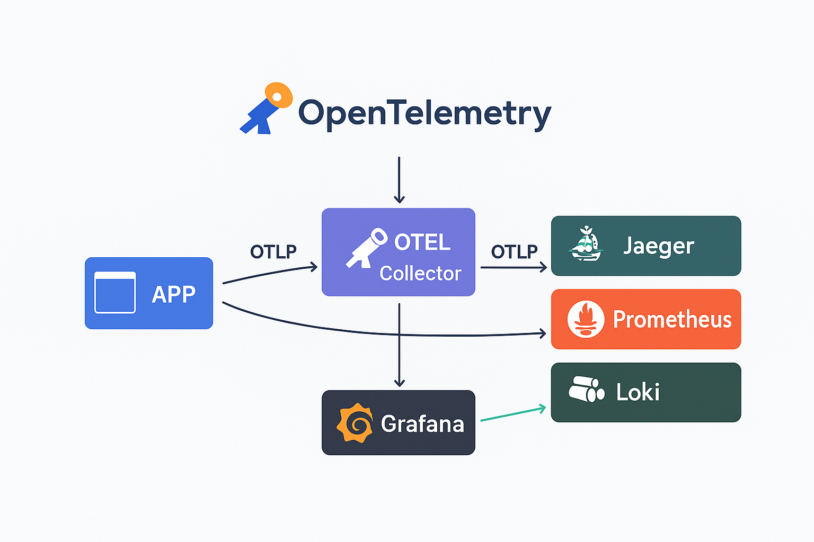

# OpenTelemetry



## 📌 Sobre o projeto

Este projeto configura uma stack completa de **observabilidade** chamada **OpenTelemetry**, que integra métricas, logs e traces em uma infraestrutura simples utilizando **Docker Compose**.

O objetivo é fornecer visibilidade unificada da aplicação, permitindo monitorar desempenho, detectar falhas e entender o comportamento do sistema em produção.

---

## 🛠️ Ferramentas Utilizadas

- **[OpenTelemetry Collector](https://opentelemetry.io/)**

  - Recebe métricas, traces e logs via **OTLP**.
  - Processa e exporta para backends como Prometheus, Jaeger e Loki.
  - Porta principal: `4317 (gRPC)` e `4318 (HTTP)`.

- **[Jaeger](https://www.jaegertracing.io/)**

  - Visualização de **traces** distribuídos.
  - Útil para acompanhar requisições ponta a ponta.
  - UI: [http://localhost:16686](http://localhost:16686)

- **[Prometheus](https://prometheus.io/)**

  - Banco de dados de séries temporais para **métricas**.
  - Coleta métricas do OpenTelemetry Collector.
  - UI: [http://localhost:9090](http://localhost:9090)

- **[Grafana](https://grafana.com/)**

  - Interface de visualização de métricas, logs e traces.
  - Conectado ao Prometheus e Loki.
  - UI: [http://localhost:3000](http://localhost:3000)
  - Login padrão: `admin / admin`

- **[Loki](https://grafana.com/oss/loki/)**

  - Armazena **logs** de forma eficiente e indexável.
  - Endereço API: [http://localhost:3100](http://localhost:3100)

- **[Promtail](https://grafana.com/docs/loki/latest/clients/promtail/)**
  - Coletor de **logs locais**.
  - Envia logs do sistema para o Loki.

---

## 🔗 Como os serviços se conectam

- **Aplicação → OpenTelemetry Collector**  
  A aplicação envia logs, métricas e traces via **OTLP (4317/4318)**.
- **Collector → Jaeger**  
  Traces são exportados para visualização.
- **Collector → Prometheus**  
  Métricas expostas no endpoint `:9464`.
- **Collector → Loki**  
  Logs enviados diretamente.
- **Promtail → Loki**  
  Coleta de arquivos de log do host.
- **Grafana → Prometheus & Loki & Jaeger**  
  Painel único para visualização de tudo.

---

## 🚀 Setup do Projeto

### 1. Pré-requisitos

- [Docker](https://docs.docker.com/get-docker/)
- [Docker Compose](https://docs.docker.com/compose/)

### 2. Clonar o projeto

```bash
git clone https://github.com/seu-usuario/opentelemetry.git
cd opentelemetry
```

### 3. Subir os containers

```bash
docker-compose up -d
```

## Acessar as ferramentas

- [Jaeger](http://localhost:16686)

- [Prometheus](http://localhost:9090)

- [Grafana](http://localhost:3000)

- [Loki (API)](http://localhost:3100)

## Configurações

- Arquivo `docker-compose.yml`: orquestra todos os serviços.

- Arquivo `otel-collector-config.yaml`: define recebedores, processadores e exportadores do Collector.

- Arquivo `prometheus.yml`: configura jobs de scraping de métricas.

- Arquivo `loki-config.yaml`: configuração do Loki.

- Arquivo `promtail-config.yaml`: define quais arquivos de log coletar

## Fluxo Geral

[APP] → [OTEL Collector] → [Jaeger | Prometheus | Loki] → [Grafana]

## Exemplo de uso

- Traces → veja requisições completas no Jaeger.

- Métricas → consulte CPU, memória e métricas customizadas no Prometheus/Grafana.

- Logs → centralize e filtre logs no Grafana (via Loki).
